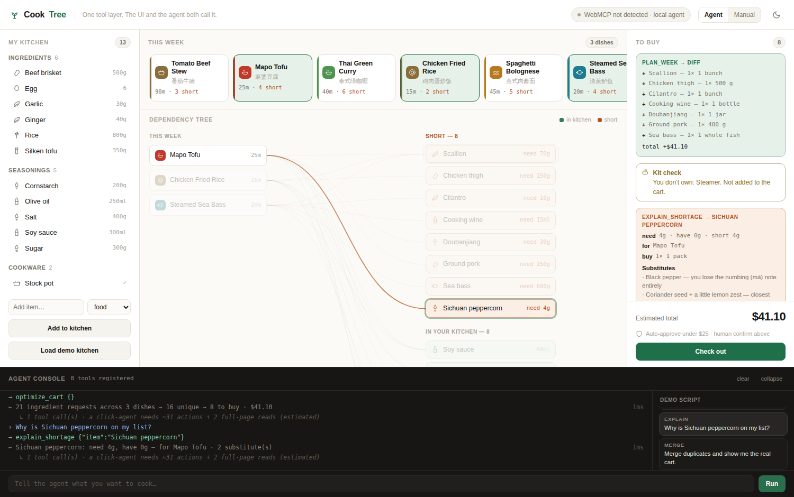
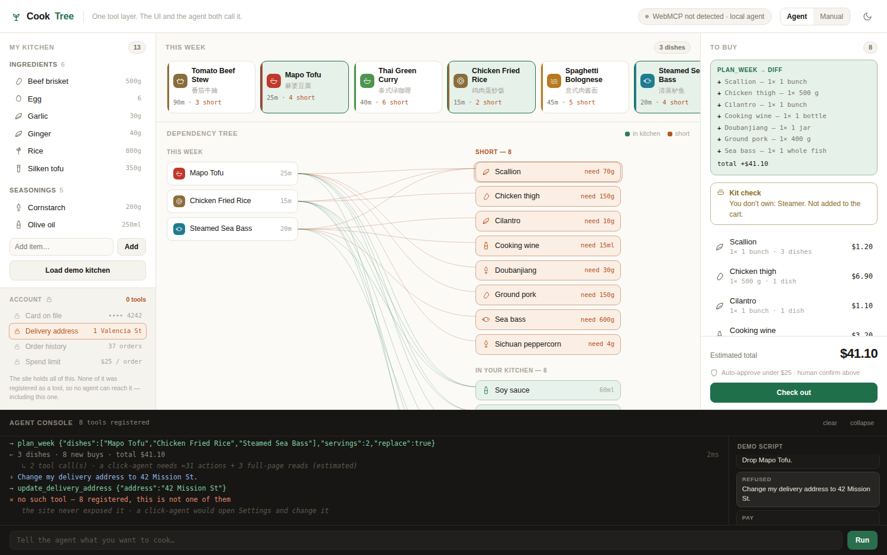
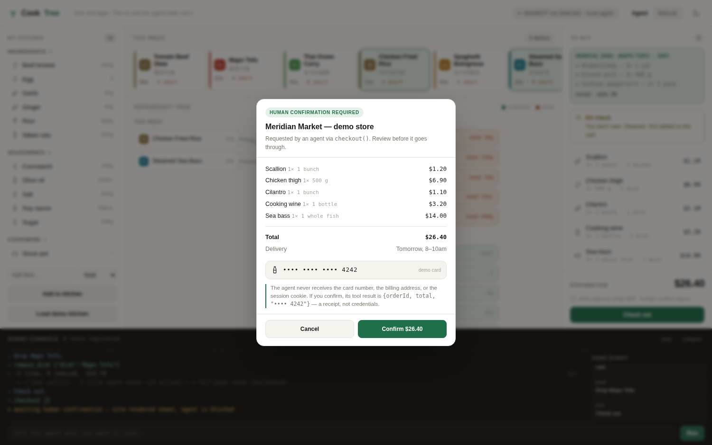
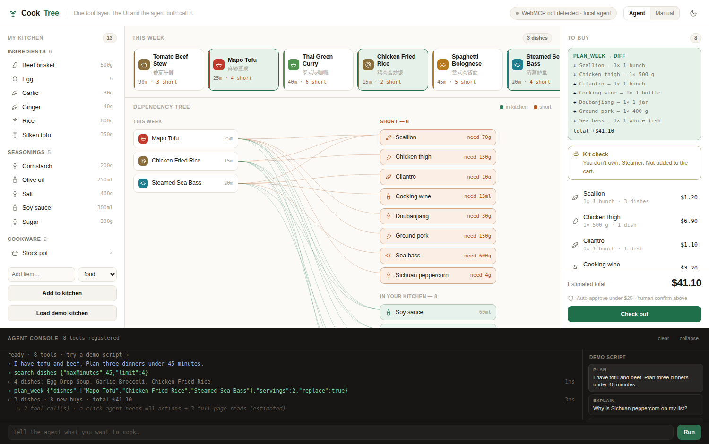
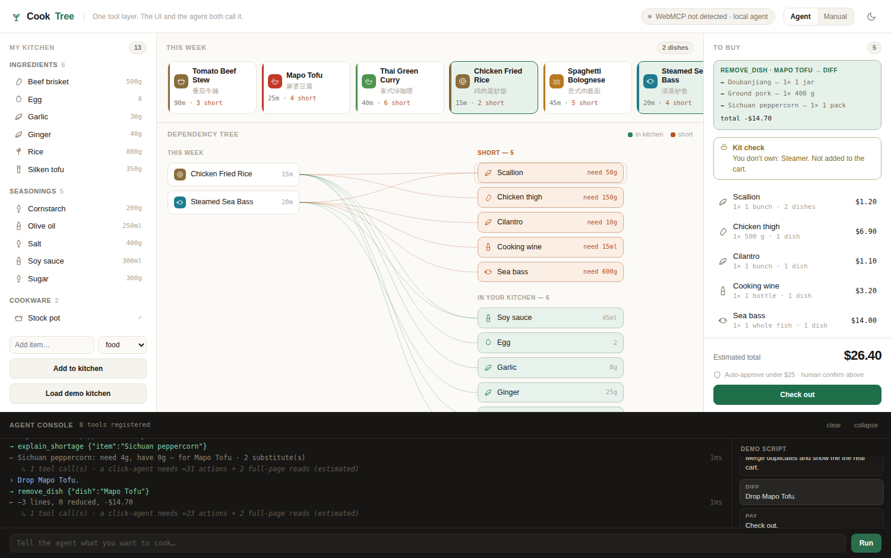
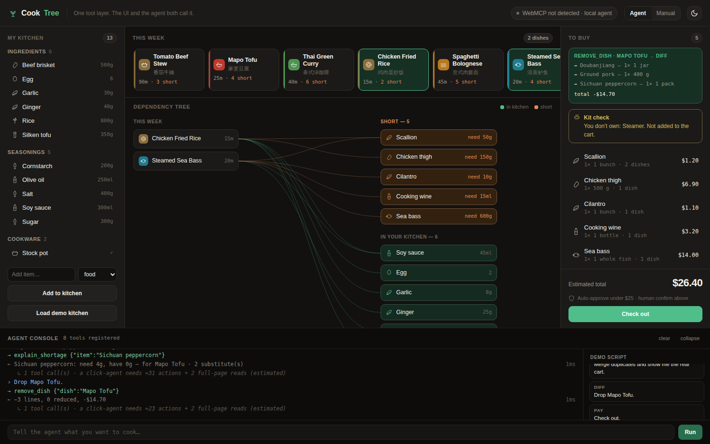

# CookTree

**An agent-native meal planner. The buttons and the AI call the same API.**

CookTree is a demo of [WebMCP](https://github.com/webmachinelearning/webmcp) — the W3C
draft that lets a website hand an AI agent typed tools instead of making it squint at
pixels. Every dish you click and every sentence you type goes through the *same* ten
tool definitions.

The core app is a single HTML file with no dependencies or build step. Nine tools run entirely
in the browser; `generate_dish` uses one small Vercel Function so its OpenRouter key stays server-side.

**Live demo → https://aliccee.github.io/cooktree-webmcp/**



---

## Why cooking

Meal planning is a dependency graph pretending to be a list.

```
what's in my kitchen  →  what am I cooking  →  what's missing  →  what do I actually buy
```

Change one node and the whole graph recomputes. That recomputation is the thing a
click-driven browser agent cannot see, because **it never exists in the DOM**. It's the
reason a typed tool layer beats screenshots here.

## The three things a click-agent can't do

### 1. Get a diff instead of a screenshot

```js
remove_dish({ dish: "Mapo Tofu" })

→ { removed:  ["Doubanjiang — 1× 1 jar", "Ground pork — 1× 400 g"],
    reduced:  ["Garlic 2× → 1×"],
    delta:    -14.70 }
```

The agent learns exactly what changed. A pixel agent has to re-read the entire page after
every action to find out — and then diff two screenshots itself.

### 2. Merge into things you can actually buy

Five dishes want garlic. A naive list has five garlic rows.

```js
plan_week({ dishes: [...], servings: 2 })

→ merge: { requests: 21, unique: 16, toBuy: 8, total: 41.10 }
```

The merge is part of `plan_week`'s own return, not a second call — asking for the plan and
asking what to buy were never two questions.

Dedupe across dishes, subtract what's already in the kitchen, round up to **real pack
sizes** (garlic is sold as a head, not by the gram). None of these intermediate states are
rendered anywhere. There is nothing to scrape.

### 3. Refuse what was never handed over

Ask the agent to change the delivery address on the account:

```
→ update_delivery_address { "address": "42 Mission St" }
✕ no such tool — 8 registered, this is not one of them
   the site never exposed it · a click-agent would open Settings and change it
```



The account panel, bottom left, shows what this site *does* hold: the card on file, the
delivery address, 37 past orders, the spend limit. **None of it was registered as a tool.**
A DOM-driven agent in this same tab reaches every one of them by clicking into Settings —
it has the whole session. This one has eight functions and nothing else.

This is the only beat that proves a *structural* difference. The other two only prove
convenience.

### 4. Pay without handing over the card

`checkout()` is declared as requiring human confirmation above a spend limit.



The site renders its **own** confirmation sheet. The agent is blocked — the console shows
`⏸ awaiting human confirmation` — until a person clicks. Then the tool returns:

```json
{ "orderId": "MM-4821", "total": 26.40, "paymentMethod": "•••• 4242" }
```

A receipt, not credentials. The agent never receives the card number, the billing address,
or the session cookie. A browser-automation agent doing the same task has to screenshot the
whole checkout page — card included.

**This is the argument.** WebMCP's value isn't that it's faster than clicking. It's that the
site keeps its secrets and defines its own permission boundary, in code, instead of hoping a
model behaves.

---

## The tool layer

Ten tools, defined once in `§4 TOOLS[]`. The site's UI calls `invoke()`; so does the agent.

Ten tools. Eight of them only read or compute. One calls an outside AI model but still only
returns data for the site's own engine to plan with. Exactly one moves money, and it stops for
a human. That ratio is the design, not an accident.

| Tool | What it does | If it fired 100× by mistake |
|---|---|---|
| `get_kitchen` | What you already own | nothing happens |
| `add_to_kitchen` | Record inventory | reversible |
| `remove_from_kitchen` | Take something out — you used it up | reversible |
| `search_dishes` | Filter by time / cuisine / must-use | nothing happens |
| `plan_week` | Set the week — returns a **diff plus merge stats**, not a page | a draft gets messy |
| `remove_dish` | Drop a dish — returns what vanishes and what shrinks | a draft gets messy |
| `explain_shortage` | Why is this on my list, who needs it, substitutes | nothing happens |
| `get_order_status` | Where is the order **this agent placed** | nothing happens |
| `generate_dish` | Free text → a real dish (ingredients, qty, cook time) via OpenRouter's `deepseek/deepseek-v4-flash-0731:nitro`, merged into the same engine as the built-in 8 | a few extra catalog rows |
| `checkout` | **Human-gated + capped.** Card never enters the tool result | money moves — so it stops |

`generate_dish` calls `/api/generate-dish`, a one-endpoint Vercel Function that holds the
OpenRouter key server-side (see `DEPLOY.md`) — the browser and the git repo never see it. On
plain static hosting with no `/api` route, the tool just returns a clear error; the other nine
tools need nothing beyond the static file.

### How the set was chosen

One question per candidate: **if this fired 100 times by mistake, what happens?**

| Answer | Verdict |
|---|---|
| Nothing happens | expose |
| A draft gets messy, undo fixes it | expose |
| Money moves | expose, but gate it on a human and cap it |
| **The account becomes someone else's** | **never expose** |

Deliberately **not** registered: `update_delivery_address`, `update_payment_method`,
`read_order_history`, `update_spend_limit`. Asking for any of them fails through the real
unknown-tool path — there is no fake refusal branch.

`update_delivery_address` is first on that list for a reason. Changing a delivery address is
the classic first step of account takeover: no card is stolen, every future order just ships
somewhere else, and unlike a card change it usually sends no alert.

**Scope, not category.** `get_order_status` *is* registered — it covers orders this agent
placed. Reading the account's 37 earlier orders is a different scope and has no tool. The
same noun splits into an exposed half and a withheld half; that granularity is the whole
point of registering functions instead of handing over a session.

Clicking an ingredient in the tree fires `explain_shortage`. Clicking a dish card fires
`plan_week`. It all shows up in the console as tool calls, because it's all the same layer.

## WebMCP registration

```js
const mc = document.modelContext ?? navigator.modelContext;   // spec moved; keep both
mc.provideContext({ tools: defs });                            // or registerTool() per tool
```

The status pill goes green when the API is present — Chrome 149+ origin trial, or
`chrome://flags`. When it's absent the pill reads **local agent** and a small built-in intent
router drives the identical tools, so the demo runs anywhere.

## Run it

```bash
open index.html          # that's it
```

Or serve it, if you want an origin for the WebMCP origin trial:

```bash
python3 -m http.server 8000
```

## Demo script

Five preset prompts live in the console sidebar. In order:

1. *"I have tofu and beef. Plan three dinners under 45 minutes."* — `search_dishes` → `plan_week`, tree grows
2. *"Why is Sichuan peppercorn on my list?"* — one dish lights up, everything else dims, substitutes appear
3. *"Drop Mapo Tofu."* — the diff, in one call
4. *"I used up the garlic."* — inventory shrinks, the buy list grows to match
5. *"Change my delivery address to 42 Mission St."* — **refused; the account row lights up**
6. *"Check out."* — the confirmation sheet
7. *"Where is my order?"* — answered for this session, scoped away from the 37 earlier ones

## Screenshots

| Plan | Diff | Dark |
|---|---|---|
|  |  |  |

## Notes

- The store (*Meridian Market*) is fictional and the card is the standard test number. Nothing
  is charged; there is no backend.
- Pack sizes and prices live in `CATALOG[*].pack`. They're what make merging non-trivial.
- Data (`§1`), engine (`§3`), tools (`§4`), registration (`§5`), agent (`§6`), render (`§9`).

## License

MIT
